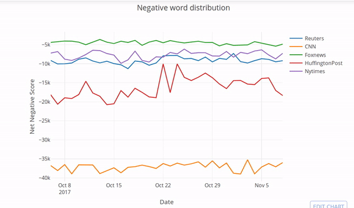

# NewsOptimism
Comparative Analysis of various news media and quantify its postiveness based on the Linguistic choice of words in their articles.

# Problem
All around the world both good and bad happens, and we get to know only those that are exposed to us. And, that’s the primary responsibility of the media. But the bigger responsibility of these media houses is the way in which they express the content to the people. 

A responsible media house’s content should be original, unbiased, free of exaggeration and should be very sensitive in handling the emotions of it’s readers and viewers. A same story could be told in different ways and these different ways could definitely trigger different emotions among it’s readers.

It is known that we become who we are by what we say and what we read. Reading a story that’s filled with positive words would make us feel more positive and vice versa. So the wordings of a content definitely plays an equal role as that of the content itself. 

This project aims to answer how some of the major media houses in USA are giving importance to the **wordings of their content**. The answer would allow the readers to wisely choose their daily source of news that truly cares about its readers.

There is a famous concept called [**Law of attraction**](http://www.thelawofattraction.com/what-is-the-law-of-attraction/) written by **Rhonda Byrne** in her book [Secret](https://en.wikipedia.org/wiki/The_Secret_(book)).It says that we become who we are by what we say!

# Key concepts:
*Text-analysis,  Lexicon based sentiment analysis, Natural Language Processing(NLP),Data extraction, Newspaper API, AFINN*

# Hypothesis:
The English(language) words are considered to find out how much of positivity or negativity an article contains. We then quantify the news website by comparing the
frequency of occurrence of the words across all articles published in that website.

# Target Audience:
The headline scrollers - people who scroll the news headlines and text directly from the media's homepage.

# Datasource:
    1. "http://www.nytimes.com/"
    2. "http://www.foxnews.com/"
    3. "http://www.reuters.com/"
    4. "http://www.cnn.com/"
    5. "http://www.huffingtonpost.com/"

These are the famous news websites considered based on the unique visitor count obtained from the [research](http://www.journalism.org/files/legacy/NIELSEN%20STUDY%20-%20Copy.pdf)

# Language:
    1. Python
    2. Sql

## Considerations to keep in mind:
1. The Linguistic choice of English words plays a key role in reader’s emotions.
2. Data is extracted from the FRONT page of the above data sources.
3. The article title and the summary are extracted.
4. Data has been scrapped from the resources at the **same** time(since it gets updated regularly).
5. Our assumption is there is no bias between choosing articles.
6. Our target audience are prone to ALL the articles published in the home page.
7. Only the USA News web market is considered for this research.
8. CNN, Foxnews, nytimes, huffingtonpost, reuters are the top news websites considered based on the unique visitor count obtained from the research.
9. Our Sample considers only the articles published in these websites at 10am(CST).

## Approach:
1. Scrapped news articles and their content from the news media websites as text document.
2. Converted those text document into csv formatted file.
3. Preprocessed the data using NLP techniques.
4. Tf-idf method is applied to find the importance of word.
5. Sentiment analysis to show how much positive or negative the news websites for each day.

# Progress:

## 1) Data Extraction Phase:

Data is collected as Text Document from the datasources as mentioned above. Have a look at the sample text file of the articles
taken from the reuters.com front page on 10/17/2017.

The data as CSV file has the following columns:

* `TITLE`: the Title of the article.
* `SUMMARY`: first few lines of the article's text.
* `TEXT`: Full text inside the article
* `URL`: web link to the article.
* `KEYWORDS`: important words in the article.

**[Have Peek at the file structure](http://nbviewer.jupyter.org/github/harishaaram/NewsOptimism/blob/master/Sample_data_peek.ipynb)**
[Download original csv file](sample/reuters.csv)

## 2) Analysis Phase:

Let’s check the distribution of negative words(words that have a negative connotation), as shown below. The media house with least projection of these negative words is Foxnews followed by New York times. They deliver the content in more optimistic way than their counterparts.

*Net Negative Score=Negative termsper media * Sentiment score*

However to build healthy society we also need to check all vocabulary content of the article, that includes both the usage of positive and negative words. Thus a Normalized score is introduced!

A Normalized score is the net sentiment score of all articles to that of the total number of term usage across all the articles in a day(which is specific to each media houses). 

*Net Normalized Score=(termsper day * Sentiment score)/Total Number of terms*

*Note: The terms positivines is calculated using a lexicon based approach, AFINN(It is a list of English words rated for valence with an integer between minus five (negative) and plus five (positive)).*

Conclusion:
Thus from the plot we can see that New York times plays an important role in not only conveying the News but also in a healthy way. Thus I recommend the Web users to go for **New york times** to get their daily news. 

*Closing Remarks:
There is a famous concept called Law of attraction written by Rhonda Byrne in her book Secret.It says that we become who we are by what we say! This has been one of the motive for this research to happen*

# Detailed Work
1. **[Walkthrough for a single article](http://nbviewer.jupyter.org/github/harishaaram/NewsOptimism/blob/gh-pages/Data_Analysis.ipynb)**
1. **[Full Project OpenSource code](https://github.com/harishaaram/NewsOptimism/tree/master/src)**

# Future directions:

Discerning the Link between the country's overall development and the role news media houses(specific to country) using the above approach. We take three different countries: USA, Singapore, India for the study.
